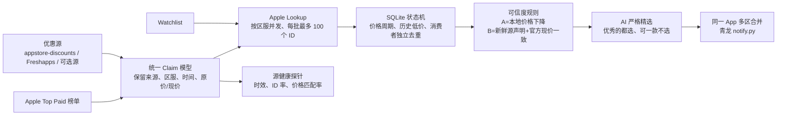

# iDeal

面向青龙的 iOS App 优惠精选项目。它把第三方网站当作“发现线索”，把 Apple Lookup 返回的当前区服价格当作最终事实，再由 AI 从真实优惠中挑出真正优秀的应用。

## 最终方案



核心原则：

- 第三方源不能决定价格，只负责提供候选和旧价证据。
- 当前价格、币种、区服、App 分类全部由 Apple 官方接口确认。
- App 本体与 IAP 分开。iDeal 默认不推送无法官方核验的 IAP/订阅优惠。
- AI 只接收已通过官方核价的候选，负责判断是否优质，不允许修改价格。
- 同一 App 的 US/CN/TR 价格合并为一条，不再占用三条通知。
- AI 未配置或调用失败时，Digest 默认不推送；Watchlist 不受影响。
- 同一 App 的多个来源不会被提前去重丢失，完整证据会写入 `source_claims`。

## 目录

```text
iDeal/
├─ config/
│  ├─ settings.json       # 区服、可信度、并发、保留周期
│  ├─ sources.json        # 数据源
│  └─ watchlist.json      # 定向监控
├─ ideal/
│  ├─ sources.py          # RSS、Reddit、榜单、HTML 适配器
│  ├─ apple.py            # Apple 批量核价
│  ├─ db.py               # SQLite 状态机
│  ├─ pipeline.py         # Digest / Watchlist 流程
│  ├─ probe.py            # 源质量检测
│  └─ notifier.py         # 青龙通知
├─ scripts/
│  ├─ run_digest.py
│  ├─ run_watchlist.py
│  ├─ run_probe.py
│  ├─ self_check.py
│  ├─ clear_state.py
│  └─ migrate_legacy.py
```

项目只使用 Python 3 标准库，不需要 `pip install`。

## AI 必需配置

Digest 默认启用 AI 严格精选，支持百炼 Qwen、DeepSeek、Google Gemini 和任意 OpenAI Chat Completions 兼容接口。

自动模式的默认调用顺序是：

```text
百炼 Qwen → DeepSeek → Google Gemini → 自定义接口
```

只调用第一个成功的提供商。Qwen 成功时不会再调用 DeepSeek 或 Gemini，因此不会同时产生三份费用。

推荐使用 Qwen：

```text
QWEN_API_KEY=你的百炼 API Key
```

或使用 DeepSeek：

```text
DEEPSEEK_API_KEY=你的 DeepSeek API Key
```

或使用 Gemini：

```text
GEMINI_API_KEY=你的 Google AI Studio API Key
```

当前默认模型分别为 `qwen3.7-plus`、`deepseek-v4-flash` 和 `gemini-3.5-flash`。可覆盖：

```text
IDEAL_AI_PROVIDER=qwen
QWEN_MODEL=qwen3.7-plus
QWEN_BASE_URL=https://dashscope.aliyuncs.com/compatible-mode/v1/chat/completions
```

```text
IDEAL_AI_PROVIDER=deepseek
DEEPSEEK_MODEL=deepseek-v4-flash
DEEPSEEK_BASE_URL=https://api.deepseek.com/chat/completions
```

```text
IDEAL_AI_PROVIDER=gemini
GEMINI_MODEL=gemini-3.5-flash
GEMINI_BASE_URL=https://generativelanguage.googleapis.com/v1beta/openai/chat/completions
```

强制只使用一家时设置 `IDEAL_AI_PROVIDER=qwen`、`deepseek` 或 `gemini`。如需调整自动回退顺序：

```text
IDEAL_AI_PROVIDER=auto
IDEAL_AI_PROVIDER_ORDER=deepseek,qwen,gemini
```

也支持任意 OpenAI Chat Completions 兼容服务：

```text
IDEAL_AI_PROVIDER=custom
IDEAL_AI_API_KEY=你的Key
IDEAL_AI_MODEL=模型名
IDEAL_AI_BASE_URL=https://你的服务/v1/chat/completions
```

AI 成功结果缓存 12 小时，减少重复调用和费用。`config/settings.json` 中：

- `minimum_priority`：AI 评分最低门槛，默认 8；
- `preference`：可直接改成你的个人偏好；
- `on_failure`：默认 `skip`，AI 失败时不推；如改为 `top_one`，仅规则兜底推 1 款。

入选数量不设上限：达到优秀门槛的都推送，不达标的一款也不推。同一 App 的多个区服只占一条；内容过长时自动分段发送，不会截断。

其他可选青龙变量：

```text
IDEAL_MONITOR_REGIONS=us,cn,tr
IDEAL_DATA_DIR=/ql/data/db/ideal
IDEAL_CONFIG_DIR=/ql/data/scripts/iDeal/config
```

按默认目录部署时，后两个变量不需要设置。

## 青龙部署

将整个目录放到：

```text
/ql/data/scripts/iDeal
```

先在青龙临时添加一个自检任务并手动执行：

```text
/ql/data/scripts/iDeal/scripts/self_check.py
```

自检会检查项目文件、Python 语法、数据目录、通知组件和当前进程能否看到各家 API Key，但不会输出 Key 内容。确认无误后可删除这个临时任务，项目运行不依赖它。

在青龙添加三个任务：

```text
15 */3 * * *  /ql/data/scripts/iDeal/scripts/run_digest.py
35 */3 * * *  /ql/data/scripts/iDeal/scripts/run_watchlist.py
10 8 * * *    /ql/data/scripts/iDeal/scripts/run_probe.py -- --rounds 2
```

青龙任务命令必须直接以 `.py` 脚本路径开头，不要添加 `python3`。青龙只有识别到 Python 脚本任务时才会按其机制注入面板环境变量；脚本参数放在 `--` 之后。

这是青龙任务包装器的实际规则，不是 iDeal 自定义的环境变量技巧：

- 青龙先检查任务命令的第一个参数，只有以 `.py` 结尾时才识别为 Python 脚本；
- 识别为 Python 脚本后，青龙通过 Python preload 把面板变量注入当前进程；
- 写成 `python3 /路径/脚本.py` 时，第一个参数变成 `python3`，会进入普通命令分支，面板变量可能在执行前被清理；
- iDeal 与原脚本一样，只通过 `os.environ` 读取变量，不读取或修改青龙内部配置文件。

官方实现可查阅青龙的
[`shell/task.sh`](https://github.com/whyour/qinglong/blob/develop/shell/task.sh)
与
[`shell/otask.sh`](https://github.com/whyour/qinglong/blob/develop/shell/otask.sh)。

三个任务分别是：

- `run_digest.py`：每 3 小时抓取优惠、Apple 核价、AI 精选并推送；
- `run_watchlist.py`：每 3 小时检查自选 App 的价格变化；
- `run_probe.py --rounds 2`：每天 08:10 对每个来源连续抓取两次，检查稳定性、时效、App ID 解析率和 Apple 价格匹配率。它不调用 AI，也不推送优惠。

首次部署可再手动执行两个试运行任务：

```text
/ql/data/scripts/iDeal/scripts/run_digest.py -- --dry-run
/ql/data/scripts/iDeal/scripts/run_watchlist.py -- --dry-run
```

`--dry-run` 会写入价格状态但不写入通知去重记录，因此下一次正式运行仍可发送相同价格周期的提醒。AI 仍会执行并使用缓存。

数据默认保存在 `/ql/data/db/ideal/`，数据库为 `ideal.db`，不会覆盖旧版 `/ql/data/db/ios_deals.db`。

### 清除测试缓存或恢复一次推送

AI 缓存和“已经推送过”是两套独立记录。先临时运行以下任务只查看数量，不修改：

```text
/ql/data/scripts/iDeal/scripts/clear_state.py
```

如果正式模式测试已经推送过一次，现在想让仍符合条件的 Digest 优惠再推一次，只清除 Digest 已提醒记录：

```text
/ql/data/scripts/iDeal/scripts/clear_state.py -- --clear-alerts digest
```

如果还要让 AI 忽略 12 小时缓存并重新评价：

```text
/ql/data/scripts/iDeal/scripts/clear_state.py -- --clear-ai-cache --clear-alerts digest
```

Watchlist 使用 `--clear-alerts watchlist`，两类任务一起清除使用 `--clear-alerts all`。该工具不会删除价格历史、Watchlist、配置或来源数据。

正常测试应优先使用 `--dry-run`，它本来就不会写入已提醒记录。通知失败时，iDeal 也不会写入已提醒记录，下次运行会自动重试。新版还会检查 `notify.py` 的返回值和输出；即使通知模块内部吞掉异常、只打印“发送失败”，也会被识别为失败。

项目不再提供 `ql_install.sh`。安装本身只有“复制目录、添加任务、运行自检”三步，额外安装脚本会和 `self_check.py` 重复，还容易把错误任务命令再次写入青龙。`self_check.py` 是部署后的临时验收工具；确认正常后，对应青龙任务可直接删除。

## 为什么 313 条核验可以很快

日志里的“313 个 App×区服组合”不是 313 次 Apple HTTP 请求，也不是 313 款 App 全部交给 AI：

1. iDeal 先按区服分组，再把同一区服最多 100 个 App ID 合并为一个 Apple Lookup 请求；
2. CN、TR、US 三个区服并发查询；
3. Apple 返回后，本地规则在内存中完成分类、价格匹配、时效判断和去重；
4. 只有本地规则留下的少量真实优惠才会合并 App 后交给 AI。

例如三个区服各约 104 个不同 ID 时，通常是每区 2 批、合计 6 个逻辑请求，而不是 313 次。Apple 官方
[`Lookup Examples`](https://developer.apple.com/library/archive/documentation/AudioVideo/Conceptual/iTuneSearchAPI/LookupExamples.html)
明确支持逗号分隔的多个 ID。

Apple 并非没有限制。其存档文档说明 Search API 大约限制为每分钟 20 次，并建议缓存 Search/Lookup 结果。iDeal 默认批量查询、按区服最多 3 路并发、失败指数退避重试，三小时执行一次 Digest，不会把几百个候选逐条轰击 Apple。实际是否触发限流仍以 HTTP 429 和 `Retry-After` 为准。

新版日志会直接打印，避免只凭总耗时猜测：

- Apple 逻辑批次数；
- 含自动重试的实际网络尝试次数；
- 每个批次的区服、ID 数、耗时和尝试次数；
- 抓源、Apple 核验、本地规则、AI、通知各阶段耗时；
- AI 外部请求次数。AI 缓存命中、没有候选或没有可用 Key 时均为 0。

## 可信度与准确率

| 等级 | 判定方式 | 默认推送 |
|---|---|---:|
| A | 本地已见过更高的官方价格，本轮官方价格下降 | 是 |
| B | 新鲜渠道明确给出原价/现价，且 Apple 当前价格与渠道现价一致 | 是 |
| C | 渠道只写“免费/降价”，没有可核对的旧价 | 否 |

这解决了两个看似矛盾的问题：

- 第一次运行也能推送有完整价格证据的真实优惠（B）。
- 只有“免费”文案、无法证明曾经付费的常年免费 App 不会误报（C）。

`config/settings.json` 中将 `minimum_confidence` 改为 `A` 可进入最保守模式；不建议降到 `C`。

默认 `allowed_primary_genre_ids` 只保留工具、效率、商务、开发、参考、教育、影音处理、财务、健康等实用分类。若要监控全品类，将该数组改为空数组；`blocked_primary_genre_ids` 仍可单独排除游戏。通过规则的候选还会经过 AI 二次精选。

## Watchlist 目标价

旧版同一个数字同时用于 USD/CNY/TRY，含义不成立。iDeal 目标价必须按区服配置：

```json
{
  "id": "1373567447",
  "regions": ["us", "tr"],
  "target_prices": {
    "us": 9.99,
    "tr": 299.99
  },
  "notify_on_any_drop": true,
  "notify_on_free": true
}
```

判定优先级为“限免 → 跨过目标价 → 任意降价”，目标价分支不再被任意降价抢先吞掉。

## 数据源配置

当前默认启用：

| 来源 | 角色 | 状态 |
|---|---|---|
| appstore-discounts（US/CN/TR） | 主要降价线索；支持明确旧价/现价 | 启用；Fastly CDN → jsDelivr → GitHub Raw 三级回退 |
| Freshapps Free / Deals | 美国区补充 RSS | 启用；无优惠时 RSS 可能合法为空 |
| Apple Top Paid（US/CN/TR） | 建立价格基线、发现后续变化 | 启用；不能单独证明首次优惠 |
| AppAgg RSS | 大量第三方优惠线索 | 预置但关闭；当前网络测试超时，且页面价格可能已过期 |
| Reddit r/AppHookup | 社区补充线索 | 预置但关闭；部分青龙出口会收到 403 |
| AppDovo | 免费/降价 HTML 线索 | 已实现适配器，默认关闭；需要解析详情页，成本较高 |
| AppsHunter | 优惠 HTML 线索 | 已实现适配器，默认关闭；当前测试为 403 |
| HK/TW/MO/PT | appstore-discounts 额外区服 | 已预置，默认关闭 |

启用额外区服需要同时修改 `sources.json` 的 `enabled` 和 `settings.json` 的 `monitor_regions`，或设置：

```sh
export IDEAL_MONITOR_REGIONS="us,cn,tr,hk,tw"
```

不建议同时盲目开启全部 HTML 源。先运行探针，只有 `App ID 解析率`、`内容时效` 和 `Apple 价格匹配率` 合格时才设为默认源。

## 源健康报告

```sh
python3 scripts/run_probe.py --rounds 2
```

报告保存在数据目录的 `reports/source_probe.json` 和 `source_probe.csv`，检查：

- 抓取成功率与平均延迟；
- 真正优惠条目数，不把欢迎页/统计页算作优惠；
- App ID 解析率；
- 明确价格声明占比；
- 最新条目距现在的小时数；
- 抽样渠道现价与 Apple 官方现价的匹配率。

这比“HTTP 200 + XML 能解析”更能判断一个源是否可用。

## 旧版迁移

先只生成迁移后的 Watchlist，人工检查各区目标价：

```sh
python3 scripts/migrate_legacy.py --legacy-dir /ql/data/scripts/ios_deals
```

确认 `config/watchlist.migrated.json` 后再替换：

```sh
python3 scripts/migrate_legacy.py \
  --legacy-dir /ql/data/scripts/ios_deals \
  --replace-watchlist
```

如需导入旧价格历史：

```sh
python3 scripts/migrate_legacy.py \
  --legacy-dir /ql/data/scripts/ios_deals \
  --legacy-db /ql/data/db/ios_deals.db \
  --import-history
```

迁移程序不会把旧版单一 `target_price` 自动套到所有币种，而是保留到 `legacy_target_price_for_manual_review` 等待人工确认。

## GitHub 同类项目结论

截至 2026-07-29，没有发现比当前上游更适合作为“消费者 iOS 降价线索”的、可直接替换且仍活跃维护的开源项目。

- [appstore-discounts/appstore-discounts](https://github.com/appstore-discounts/appstore-discounts)：仍在持续维护，是最值得复用的上游；支持多地区、App 本体与 IAP 追踪、RSS/Telegram/钉钉。iDeal 将它作为主线索，但仍逐条用 Apple 核价。
- [Idlevelopment/appstore-discount-sync](https://github.com/Idlevelopment/appstore-discount-sync)：近期仍有维护，但用途是帮助开发者同步自己 App Store Connect 的 IAP 价格档位，不是消费者优惠监控器。
- [HsiangHo/appstore-discounts](https://github.com/HsiangHo/appstore-discounts)：同项目的旧分支/派生，维护活跃度不如主仓库。
- [lucafluri/price_tracker](https://github.com/lucafluri/price_tracker)：通用购物价格跟踪器，不是 App Store 优惠数据源。

最好的做法不是换掉 `appstore-discounts`，而是采用本项目的组合：主仓库负责发现、Apple 负责核价、本地状态机负责确认价格变化、健康探针负责淘汰坏源。

## 限制

- Apple Lookup 能确认 App 本体当前价格，不能可靠、公开地确认所有 IAP/订阅历史价。因此 IAP 默认只存证，不推送。
- Apple 榜单是发现与建档手段，不是优惠事实来源。
- 第三方源可能在优惠结束后仍保留旧条目；B 级规则会因为官方现价不匹配而拒绝推送。
- 首次建档且只有 C 级文案证据时不会提醒；后续官方价格发生真实下降时会升级为 A 级。
- AI 无法可靠判断价格真伪，因此它永远放在 Apple 核价之后；没有 AI 时 Digest 默认宁可不推。

## 许可证与免责声明

项目代码采用 [MIT License](LICENSE)。

- 软件按“原样”提供，不附带任何明示或暗示担保；使用者自行承担部署、通知、API 调用和数据判断风险。
- App Store、Apple 及相关商标归其权利人所有，本项目与 Apple Inc. 没有关联或背书关系。
- 第三方数据源的内容、接口和商标归各自权利人所有；使用者应遵守所在地法律、相关网站条款和接口频率限制。
- 不要把 API Key、通知凭据、数据库、运行日志或个人 Watchlist 提交到公开仓库。
